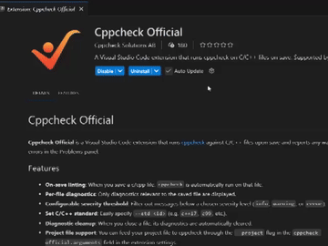

# Cppcheck Official

**Cppcheck Official** is a Visual Studio Code extension that runs [cppcheck](https://cppcheck.sourceforge.io/) against C/C++ files upon save and reports any warnings or errors in the Problems panel.

## Features

- **On-save linting**: When you save a c/cpp file, `cppcheck` is automatically run on that file.
- **Per-file diagnostics**: Only diagnostics relevant to the saved file are displayed.
- **Configurable severity threshold**: Filter out messages below a chosen severity level (`info`, `warning`, or `error`).
- **Diagnostic cleanup**: When you close a file, its diagnostics are automatically cleared.
- **Project file support**: You can feed your project file to cppcheck through the `--project` flag in the `cppcheck-official.arguments` field in the extension settings. (See GIF below)

- **Warning notes**: Display notes for warnings when those are available
- **Dynamic config**: The extension supports running a script to generate arguments to pass to cppcheck. This can be done by including the command in the argument field wrapped with \${}, e.g. `--suppress=memleak:src/file1.cpp ${bash path/to/script.sh}`. The script is expected to output the argument(s) wrapped with \${}. If the script e.g. creates a project file it should print out as `${--project=path/to/projectfile.json}`. This output will be spliced into the argument string as such: `--suppress=memleak:src/file1.cpp --project=path/to/projectfile.json`.

## Requirements

 **Cppcheck** must be installed on your system.
  - By default, this extension looks for `cppcheck` on the system PATH.
  - Alternatively, specify a custom executable path using the `cppcheck-official.path` setting.

Examples of installing Cppcheck:
  - On Linux (Debian/Ubuntu), install via `sudo apt-get install cppcheck`.
  - On macOS with Homebrew: `brew install cppcheck`.
  - On Windows, install from [cppcheck's website](https://cppcheck.sourceforge.io/).

## Extension Settings

This extension contributes the following settings under `cppcheck-official.*`:

- **`cppcheck-official.enable`**: (boolean) Enable or disable the extension.  
- **`cppcheck-official.minSeverity`**: (string) Minimum severity to report (`info`, `warning`, or `error`).  `info` shows style, performance, portability and information messages.
- **`cppcheck-official.arguments`**: (string) Additional [command line arguments](https://cppcheck.sourceforge.io/manual.pdf?#page=5) to pass to `cppcheck`.  
- **`cppcheck-official.path`**: (string) Path to the `cppcheck` executable. If left empty, `cppcheck` from the system PATH is used. Supports paths relative to workspace folder on the formats `./RELATIVE_PATH`, `../RELATIVE_PATH` or `${workspaceFolder}/RELATIVE_PATH`.

## Reporting Issues
Please submit any issues or feature requests via the [GitHub Issues page](https://github.com/cppchecksolutions/vscode-cppcheck-official/issues).

## Acknowledgements
This plugin is forked from the plugin cppcheck-lite by Justus Rijke (https://github.com/JustusRijke/Cppcheck-Lite).