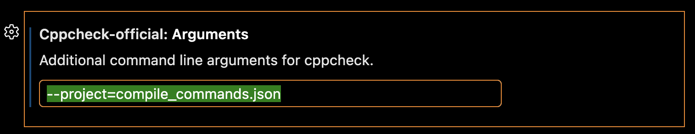

Cppcheck works best for you if you set it up according to your needs. You may e.g. want to disable certain kinds of warnings, and if you have cppcheck premium you will need to set this up for it to work in this extension. All of this is done through the extension property 'arguments', with the different flags or arguments available being detailed in the [official cppcheck documentation](https://files.cppchecksolutions.com/manual.pdf#page=13).

It is recommended to set up these settings in the workspace settings so that you and your team easily can work with the same set up. Furthermore you are likely to want to have the same settings between VS Code and your CI workflows. This is most easily done through project files, which are referenced from the argument setting (see [documentation](https://files.cppchecksolutions.com/manual.pdf#page=4) for how to create a project file).

Another way of synching your set up between different environments is through using scripts. The argument property supports running scripts with the syntax `@(/path/to/script.sh)`. The extension expects this script to output what to use for arguments wrapped with `@()`, so e.g. `echo "@(--report-progress --enable=style --inconclusive --suppress=syntaxError)"`.

[Set up arguments](command:cppcheck-official.configureArguments)