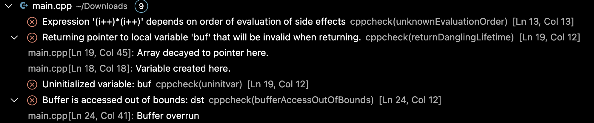

Open a .c or .cpp file and save it. If cppcheck detects any issues these will show up in the problems tab in the bottom of your VS Code window.

The extension is in continuous development, so if you find issues, have feature requests or some other kind of feedback we are happy to recieve it at the [Cppcheck Official github page](https://github.com/cppchecksolutions/vscode-cppcheck-official/issues).